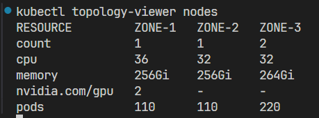
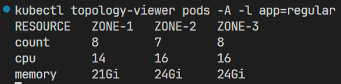

# topology-viewer
Kubectl Krew plugin to view how the cluster is spread accross topologies

## Demo




## Examples
> **All the examples are in standalone-mode, if topology-viewer was installed via `Krew` the commands need to start with `kubectl topology-viewer`**

- View nodes
    ```bash
    topology-viewer nodes
    ```
- View all pods (all namespace)
    ```bash
    topology-viewer pods -A
    ```
- View pods (all namespace)
    ```bash
    topology-viewer pods -A -l key1=value1,key2=value2
    ```
- View pods with specific namespace
    ```bash
    topology-viewer pods -n namespace -l key1=value1,key2=value2
    ```
- View pods with current namespace
    ```bash
    topology-viewer pods -l key1=value1,key2=value2
    ```
- View nodes and use different topology key (how the cluster is spread by arch)
    ```bash
    kubectl topology-viewer nodes --topology-key kubernetes.io/arch
    ```
- View pods and use different topology key (how the cluster is spread by arch)
    ```bash
    kubectl topology-viewer pods -A -l key1=value1,key2=value2 --topology-key kubernetes.io/arch
    ```

## Installation
The recommended installation method is via `krew`.

### Via Krew
Krew is a kubectl plugin manager. If you have not yet installed krew, get it at https://github.com/kubernetes-sigs/krew. Then installation is as simple as

> :warning: **this is a temporary method until (and if) the plugin will be accepted to the Krew Index**

```bash
kubectl krew install --manifest-url=https://raw.githubusercontent.com/TalShafir/topology-viewer/refs/heads/master/topology-viewer.yaml
```

The plugin will be available as `kubectl topology-viewer`.

### Via go install
```bash
go install github.com/TalShafir/topology-viewer@latest
```

### Binaries

When using the binaries for installation, you should remove the `kubectl` prefix of the usage examples.

#### Linux
```bash
curl -LO https://github.com/TalShafir/topology-viewer/releases/latest/download/topology-viewer_Linux_x86_64.tar.gz \
&& tar xf topology-viewer_Linux_x86_64.tar.gz topology-viewer \
&& chmod u+x topology-viewer \
&& mv -i topology-viewer /usr/bin/topology-viewer
```

#### OSX

##### Arm
```bash
curl -LO https://github.com/TalShafir/topology-viewer/releases/latest/download/topology-viewer_Darwin_arm64.tar.gz \
&& tar xf topology-viewer_Darwin_arm64.tar.gz topology-viewer \
&& chmod u+x topology-viewer \
&& mv -i topology-viewer /usr/bin/topology-viewer
```

##### Intel
```bash
curl -LO https://github.com/TalShafir/topology-viewer/releases/latest/download/topology-viewer_Darwin_x86_64.tar.gz \
&& tar xf topology-viewer_Darwin_x86_64.tar.gz topology-viewer \
&& chmod u+x topology-viewer \
&& mv -i topology-viewer /usr/bin/topology-viewer
```